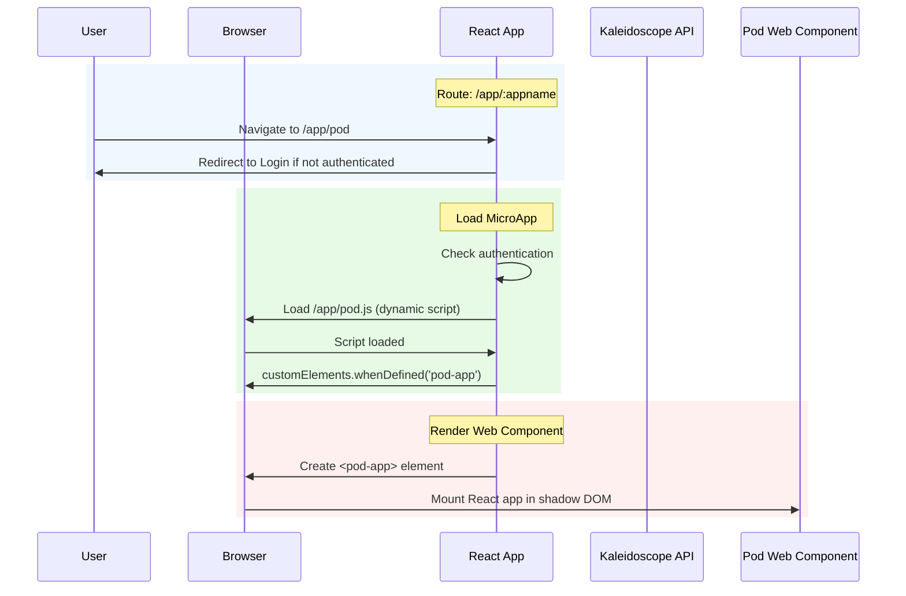
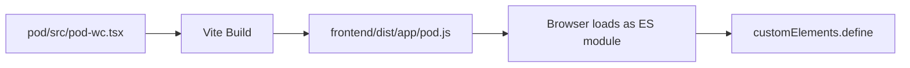

# Architecture

## Microservice Proxy

### Overview

The microservice proxy enables the backend to route requests to downstream microservices based on URL path patterns, while maintaining authentication and observability.

### Request Flow

```mermaid
sequenceDiagram
    participant Client
    participant Backend
    participant Proxy as Microservice Proxy
    participant Database
    participant Service as :appname.service

    Client->>Backend: GET /app/myapp/api/users
    Backend->>Proxy: Pass request
    
    rect rgb(240, 248, 255)
        Note over Proxy: Authentication Check
        Proxy->>Client: Check Authorization header
        alt JWT or Hawk
            Client->>Backend: Bearer token / Hawk auth
        else No Auth
            Backend-->>Client: 401 Unauthorized
            return
        end
    end
    
    rect rgb(230, 250, 230)
        Note over Proxy: Query User Info
        Proxy->>Database: SELECT username FROM users WHERE uid = ?
        Database->>Proxy: username
    end
    
    rect rgb(255, 240, 240)
        Note over Proxy: Create OTEL Span
        Proxy->>Proxy: Start span with app.name, target.url, user.id
    end
    
    rect rgb(255, 250, 240)
        Note over Proxy: Forward Request
        Proxy->>Service: GET /api/users<br/>X-UID: user-id<br/>X-Username: username<br/>trace-context headers
        Service->>Proxy: Response
        Proxy->>Proxy: End span
    end
    
    Proxy->>Client: Forward Response
```

### Routing Rules

| Path Pattern | Target URL | Example |
|--------------|------------|---------|
| `/app/myapp/` | `http://myapp.service/` | - |
| `/app/myapp/api/users` | `http://myapp.service/api/users` | - |

### Configuration

In `config.yaml`:

```yaml
microservice:
  enabled: true
  service_domain: "service"  # Kubernetes service domain suffix
```

### Authentication

- All `/app/*` routes require user authentication
- Supports JWT (Bearer token) and Hawk authentication
- Authentication is enforced via `CombinedAuth` middleware

### Headers Forwarding

The proxy forwards the following headers to downstream services:

| Header | Description |
|--------|-------------|
| `X-UID` | User ID from database |
| `X-Username` | Username from database |
| `W3C Trace Context` | OTEL propagation headers |

### Observability

- Creates OTEL span with attributes: `app.name`, `target.url`, `user.id`
- Injects trace context into proxied requests for distributed tracing

### Security

- Path traversal prevention via `path.Clean()`
- Authentication required for all proxied requests
- User identity passed via headers (not in URL)

## Frontend Micro-Frontend Architecture

### Overview

The frontend uses a Web Component-based micro-frontend architecture. Pod is built as a custom element and loaded dynamically by the MicroAppPage.

### Request Flow



### Build Output



### Configuration

- Build output: `frontend/dist/app/:appname.js`
- Custom element tag: `:appname-app`
- Route pattern: `/app/:appname`
